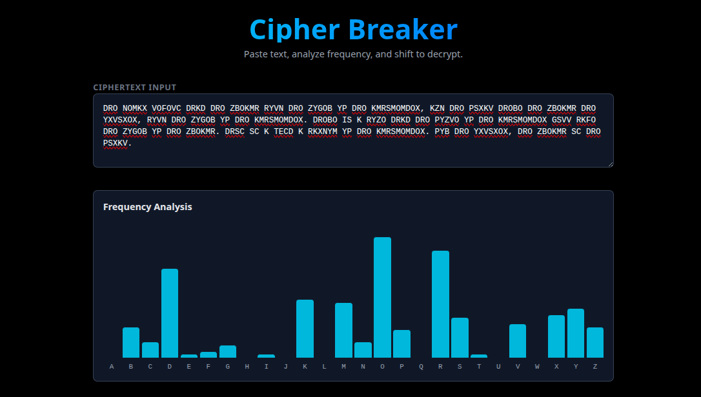
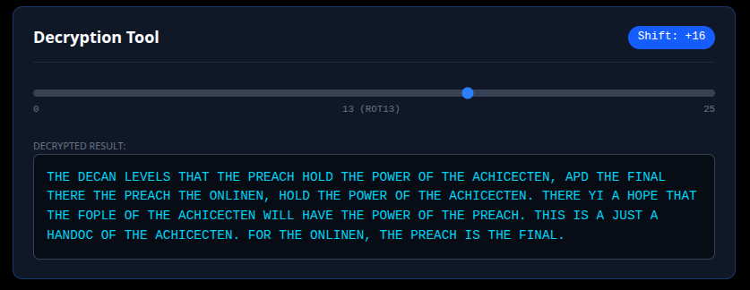

# 🔐 Cipher Breaker


**Cipher Breaker** is a modern, interactive web tool designed for CTF players and cryptography enthusiasts. It helps you break substitution ciphers (like Caesar and ROT13) and decode common data formats instantly.

Built with a "Hacker UI" aesthetic, it features real-time frequency analysis, data visualization, and immersive visual effects.

---

## 📸 Screenshots

### 🖥️ Full Interface


### 🔍 Feature Details
| **Frequency Analysis** | **Real-Time Decryption** |
|:---:|:---:|
|  |  |

---

## ✨ Features

### 🛠️ Core Tools
* **📊 Real-Time Frequency Analysis**: Instantly visualizes the letter distribution of any text to spot statistical anomalies (like the letter 'E').
* **🔓 Instant Decryption**: A "Shift Slider" that rotates the alphabet in real-time (0-25), allowing you to crack Caesar ciphers without page reloads.
* **🕵️ Decoder Suite**: One-click decoding for common CTF formats:
    * **Base64**
    * **Hexadecimal**
    * **Binary**

### 🎨 Hacker UI & Visuals
* **🌧️ Matrix Rain Effect**: A fully animated, falling code background rendered on HTML5 Canvas.
* **📺 CRT Scanlines**: A retro monitor overlay to give the tool a cyberpunk feel.
* **⌨️ Typewriter Animation**: Decrypted text types out character-by-character for a satisfying "data streaming" effect.
* **🌑 High Contrast Mode**: Optimized for readability with glowing cyan accents on a deep black background.

---

## 🚀 Getting Started

Follow these steps to run the project locally on your machine.

### Prerequisites
* Node.js (v18 or higher)
* npm or yarn

### Installation

1.  **Clone the repository**
    ```bash
    git clone [https://github.com/sakibmujbain/cipher-cracker.git](https://github.com/sakibmujbain/cipher-cracker.git)
    cd cipher-cracker
    ```

2.  **Install dependencies**
    ```bash
    npm install
    ```

3.  **Run the development server**
    ```bash
    npm run dev
    ```

4.  **Open your browser**
    Navigate to [http://localhost:3000](http://localhost:3000) to start cracking codes!

---

## 🧠 How to Use

### 1. Analyze & Decode
Paste your encrypted text (Ciphertext) into the input box.
* **Is it gibberish?** Try the **Base64**, **Hex**, or **Binary** buttons to clean it up.
* **Is it letters?** Look at the **Frequency Chart**. If 'H' is the tallest bar, but you know 'E' should be, the shift is likely around +3.

### 2. Crack the Code
Scroll down to the **Decryption Tool**.
* Drag the slider to shift the letters.
* Watch the **Typewriter Animation** reveal the text in real-time.
* **Pro Tip:** If a cipher was shifted by **+5**, you need to shift it back. In the slider (which adds), use **21** (26 - 5 = 21) to loop back around!

---

## 🛠️ Tech Stack

* **Framework:** [Next.js 15](https://nextjs.org/) (App Router)
* **Styling:** [Tailwind CSS v4](https://tailwindcss.com/)
* **Language:** [TypeScript](https://www.typescriptlang.org/)
* **Graphics:** HTML5 Canvas (for Matrix Rain)

---

## 🤝 Contributing

Contributions are welcome! If you have ideas for new ciphers (like Vigenère or Affine), feel free to open an issue or submit a pull request.

1.  Fork the Project
2.  Create your Feature Branch (`git checkout -b feature/AmazingFeature`)
3.  Commit your Changes (`git commit -m 'Add some AmazingFeature'`)
4.  Push to the Branch (`git push origin feature/AmazingFeature`)
5.  Open a Pull Request

---

## 📝 License

Distributed under the MIT License. See `LICENSE` for more information.

---

<div align="center">
  <p>Made with 💻 and ☕ by <b>Sakib</b></p>
</div>